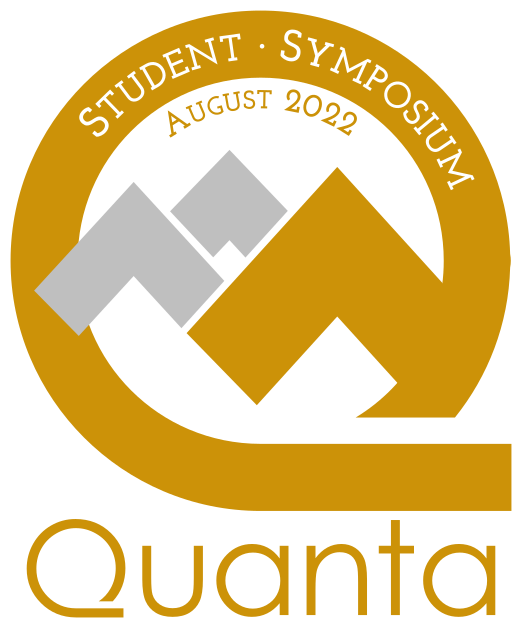

# Quanta Computing Challenges & Exploration

# :mag: Introduction
The purpose of this activity is to provide an an accessible, interactive, and safe learning environment where particpants can explore and push themselves in quantum computing topics. It features three (or four) lab challenges using IBM's open-source [Qiskit](https://qiskit.org/) software package and free interactive textbook.

We recognize that participants will have *widely* varying levels of experience in quantum computing. This is ok! No one is expected to be an expert, but rather to learn and grow from where they are at. For that reason, this workshop is designed to be practical, hands-on, and interactive. Participants will be randomly paired and work together through the challenges. For incentive, participants completing the various sub-challenges can enter to win one of three tiered raffle prizes. Winners will be randomly drawn at the end of the symposium. :tada:

<h3 align="center"> :link: <a href="https://learn.qiskit.org/syllabus/NLE-AV2">Here is the link to the challenges</a> :link:</h3>

## :dart: Learning Outcomes
By the end of this session, participants will be able to:
1. Identify the Qiskit Textbook as a free resource for personal learning of quantum computation.
2. Construct and execute a quantum circuit using Qiskit. 
3. Recognize various single- and multi-qubit gates and predict their effects on a qubit's state.

## :loudspeaker: Preliminary Instructions:
* State space of a qubit
* Setting up a quantum cicuit
  * The difference between classical and quantum channels
* Registering with IBM Quantum Experience

(*The following paragraphs are personal notes for designing the introductory presentation* )

> There are lots of different platforms for designing quantum circuits. Qiskit is just one of them. The reason we have chosen to work with this ons is because of the availability and accessibliity of IBM's online interactive textbook. For individuals who are new to this, it gets them off the ground faster; for those with more experience, this provides them an easy opportunity to explore the functionality.

> Instruction will be very minimal; participants will be required to study and seek out answers with their assigned partner. I am willing to help as a resource, but my abilities will be limited with such a large group. I've provided tips and suggestions for when you get stuck. When 30 minutes remain, I will update the website with my pages of solutions that I compiled while working through these labs myself.

> The purpose of these challenges is to provide a venue for us to learn and explore. Maybe we know about these concepts, and we know that there are companies and tools to use, but we might not have set aside time to really engage with them. We should acknowlege that we are all learning here. This should be a safe place to “Take chances, make mistakes, and get messy!” Raise your hand if you agree with this!

## :warning: Disclaimer:
The Quanta Symposium organizers did not write these labs and exercises. We are not responsible for the typos and inconsistencies you might notice. :grimacing:

## :warning: Warnings:
* These labs will be easier to those with Python experience.
* If your lab page is inactive for too long, the kernel will die and you will have to refresh the page in order to execute any code.
* **If you refresh the page, all previously entered code will be lost**. Before doing so, we recommend you copy your code to a text editor.
* Some of the pre-written Qiskit functions are deprecated. In that case, you will have to search and find the correct replacement functions.

## :point_up: General tips:
* It may be helpful to review some of the Prerequisite and Other Relevant Material at the beginning of each lab.
* For testing out circuit configurations, try using the [drag-and drop Quirk simulator](https://algassert.com/quirk)
* The "Scratchpad" lab sidebar can be helpful for debugging Qiskit code.
* Google is your friend. External resources such as StackExchange can be very helpful.
* There are also links throughout the labs to relevant portions of the Qiskit textbook. 
* Sometimes it's helpful to visually display the quantum circuit, i.e. `qc.draw()` or `display(qc.draw())`.
* A `QuantumCircuit` object can contain both quantum and classical channels. Calling `qc = QuantumCircuit(2, 1)` will create a circuit with 2 quantum channels and one classical channel.
* The [Qiskit documentation pages](https://qiskit.org/documentation/#) for individual functions can be helpful.

[Here's a document](https://raw.githubusercontent.com/qiskit-community/qiskit-textbook/main/content/ch-states/supplements/single-gates-cheatsheet.pdf) listing many different single-qubit quantum gates as they appear in Qiskit.

(* Take a picture of the group seated in the computer lab *)
(What if members of the same group don't want to do the same Lab??)
(How do participants login to the computers?? I need to go back.)

## :page_with_curl: Instructions
1. Take a few minutes to introduce yourself to your partner and get to know them. You might ask questions such as:
    * :rocket: If you were setting off to Mars and could take only one luxury item with you, what would it be?
    * :sun_with_face: If you had to describe how you’re feeling right now as a weather pattern, what’s your forecast?
    * :alarm_clock: What’s one thing you’ve been procrastinating on and can’t finish?
    * :blossom: What are you grateful for today?
2. Review the [challenge labs](https://learn.qiskit.org/syllabus/NLE-AV2), and select one to begin with. Below is a table describing the different challenges. The estimated times should roughly indicate the difficulty of each challenge.
<table>
<thead>
  <tr>
    <th>Raffle Level</th>
    <th>Lab Name</th>
    <th>Description</th>
    <th>Est. Completion Time</th>
  </tr>
</thead>
<tbody>
  <tr>
    <td>Level 1</td>
    <td>Lab 2: Single Qubit Gates</td>
    <td>Explore the effects of gates on a qubit's state.</td>
    <td>20 min</td>
  </tr>
    <tr>
    <td>Level 1</td>
    <td>Lab 4: Bell Circuit & GHZ Circuit</td>
    <td>Construct maximally entangled multi-qubit states.</td>
    <td>35 min</td>
  </tr>
  <tr>
    <td>Level 2</td>
    <td>Lab 1: Quantum Circuits</td>
    <td>Contruct classical logic circuits using quantum gates. Test on a real quantum computer.</td>
    <td>30-45 min</td>
  </tr>
  <tr>
    <td>Level 3</td>
    <td>Lab 3: Quantum Measurements</td>
    <td>Compute expectation values in the computational basis. Calculate hydrogen hyperfine energy. Execute on a quantum computer.</td>
    <td>60-90 minutes</td>
  </tr>
</tbody>
</table>

3. After completing one challenge, try another one!
4. When only 30 minutes remain in our session, solutions to the challenges will be posted
5. At the end of the session, you will fill and submit an exit survey giving **anonymous** feedback on this session; on the submission confirmation page there is a link to the raffle submission survey. (We don't have a practical way to assess every person's work. :memo: Submissions will be self-assessed and "on your honor". :raising_hand:)

<h3 align="center"> :arrow_right: <a href="https://docs.google.com/forms/d/e/1FAIpQLSeJO9WOijwg9UhQwZIoX7p2etslehoy12ZFFj8S2q7jWGt0cQ/viewform?usp=sf_link">Here is the link to the exit survey</a> :arrow_left:</h3>

